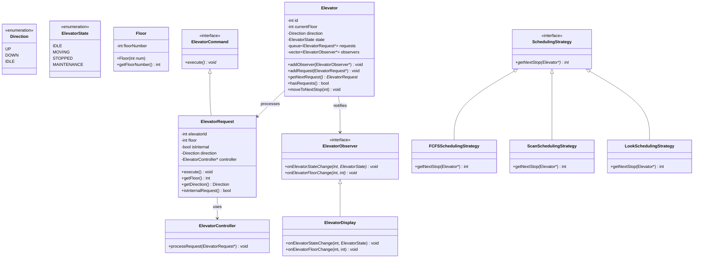
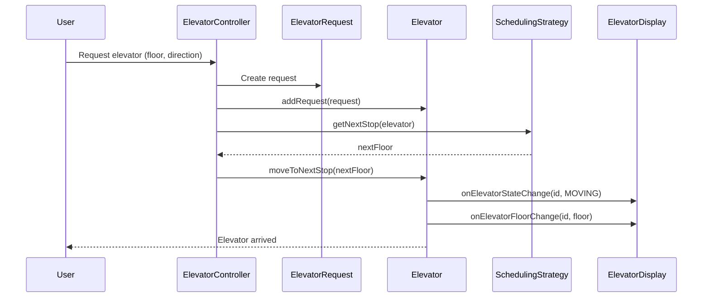
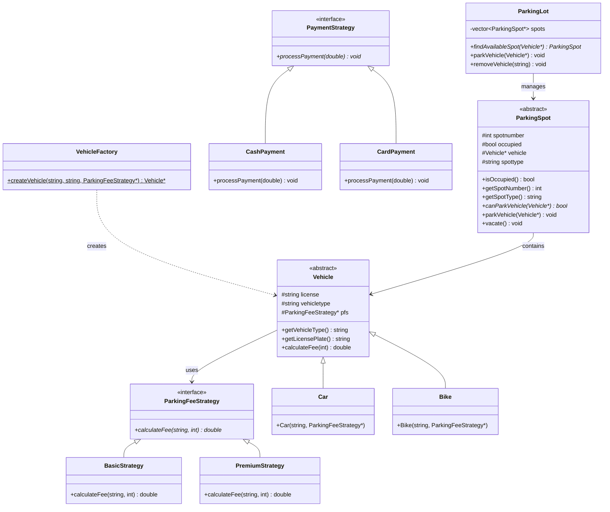
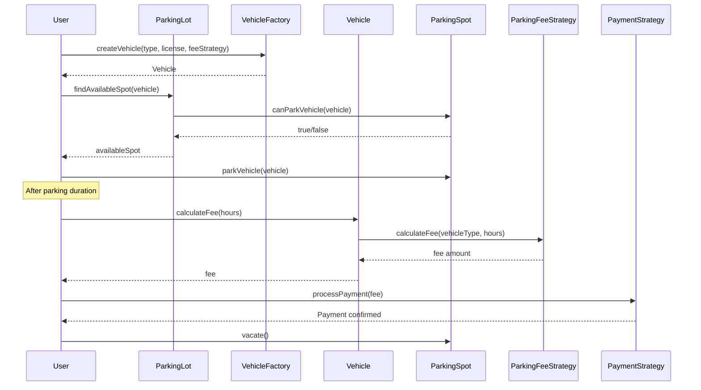
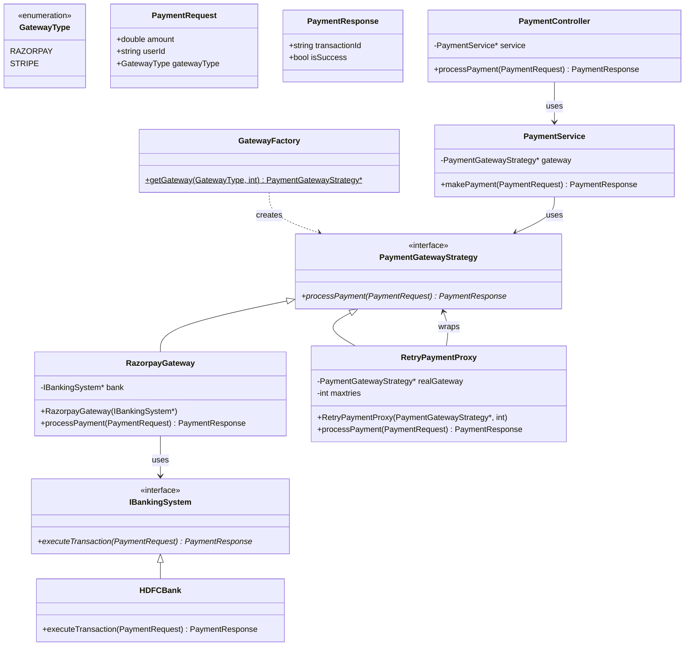
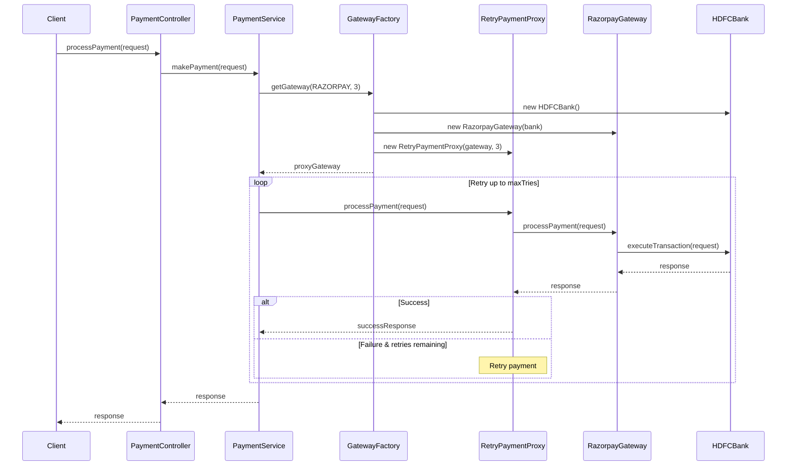
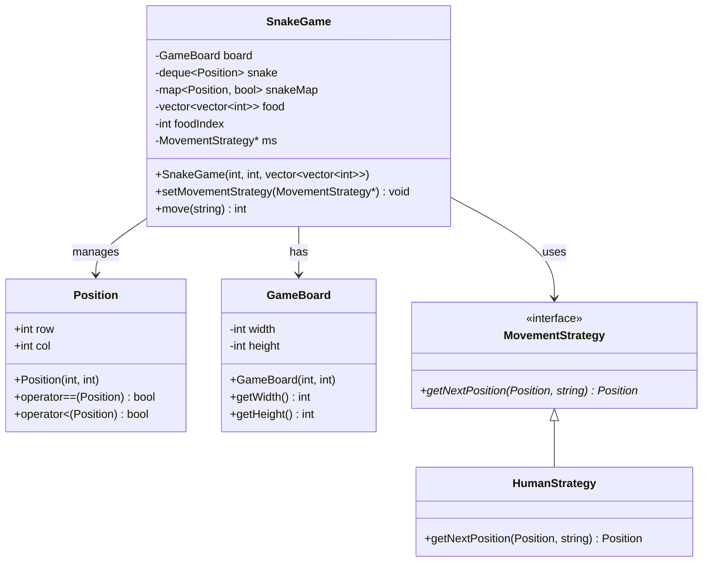
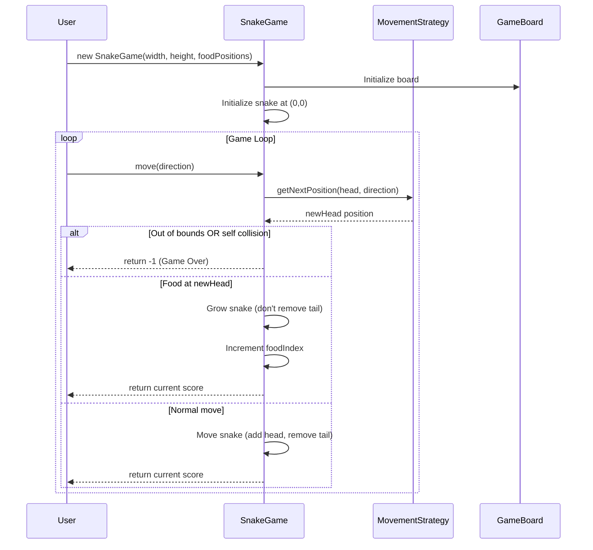
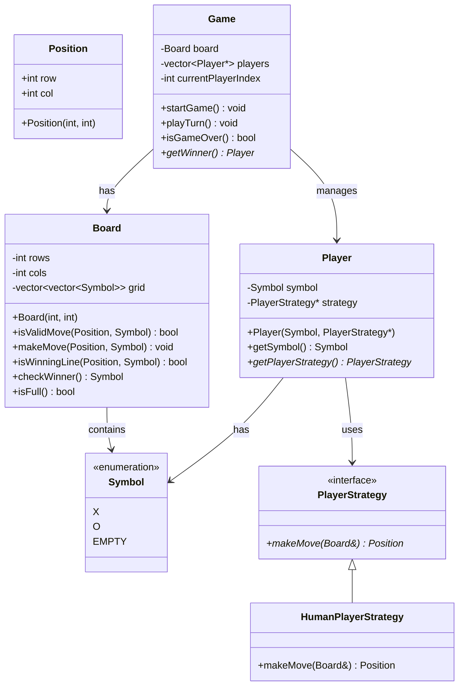
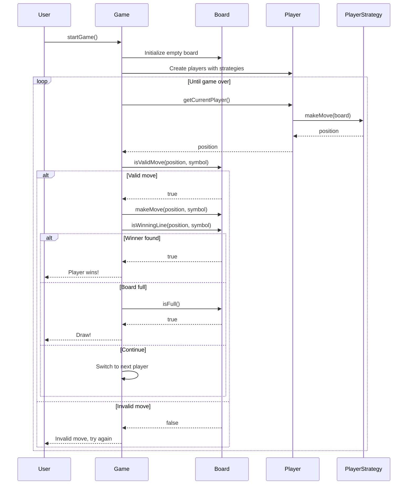

# Low-Level Design Problems

This repository contains implementations of various Low-Level Design (LLD) problems in C++, demonstrating the use of common design patterns. 

---

## Table of Contents
1. [Elevator System](#1-elevator-system)
2. [Parking Lot](#2-parking-lot)
3. [Payment Gateway](#3-payment-gateway)
4. [Snake and Food Game](#4-snake-and-food-game)
5. [Tic-Tac-Toe](#5-tic-tac-toe)

---

## 1. Elevator System

### Overview
A multi-elevator system with scheduling capabilities, using Command, Observer, and Strategy patterns.

### Design Patterns Used
- **Command Pattern**: Encapsulates elevator requests as command objects
- **Observer Pattern**:  Notifies displays when elevator state/floor changes
- **Strategy Pattern**: Different scheduling algorithms (FCFS, Scan, Look)

### Class Diagram

### Sequence Diagram

---

## 2. Parking Lot

### Overview
A parking lot management system with different vehicle types, parking spots, and payment strategies.

### Design Patterns Used
- **Strategy Pattern**: Different fee calculation strategies (Basic, Premium) and payment strategies (Cash, Card)
- **Factory Pattern**: Vehicle creation via VehicleFactory

### Class Diagram

### Sequence Diagram

---

## 3. Payment Gateway

### Overview
A payment gateway system supporting multiple payment providers with retry mechanisms. 

### Design Patterns Used
- **Strategy Pattern**: Different payment gateways (Razorpay, Stripe)
- **Proxy Pattern**: RetryPaymentProxy for automatic retry on failures
- **Factory Pattern**: GatewayFactory for creating gateway instances
- **Adapter Pattern**: IBankingSystem adapts different bank implementations

### Class Diagram

### Sequence Diagram

---

## 4. Snake and Food Game

### Overview
Classic snake game implementation with configurable movement strategies.

### Design Patterns Used
- **Strategy Pattern**: Different movement strategies (HumanStrategy for manual control)

### Class Diagram

### Sequence Diagram

---

## 5. Tic-Tac-Toe

### Overview
Tic-Tac-Toe game with configurable player strategies for different input methods.

### Design Patterns Used
- **Strategy Pattern**: Different player strategies (Human, potentially AI)

### Class Diagram

### Sequence Diagram

---
